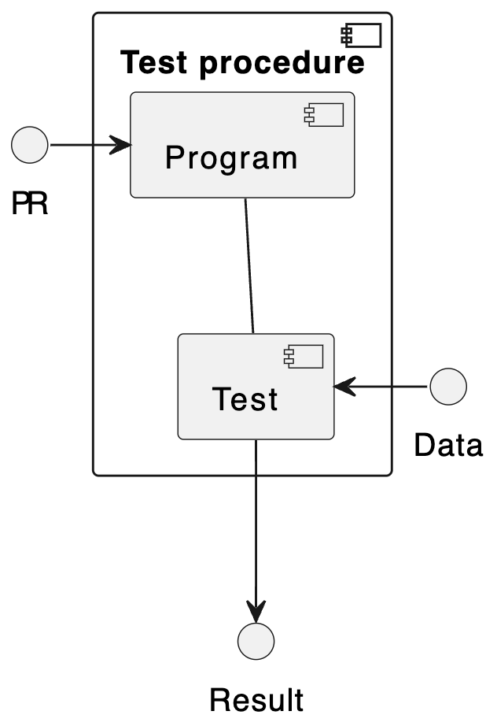
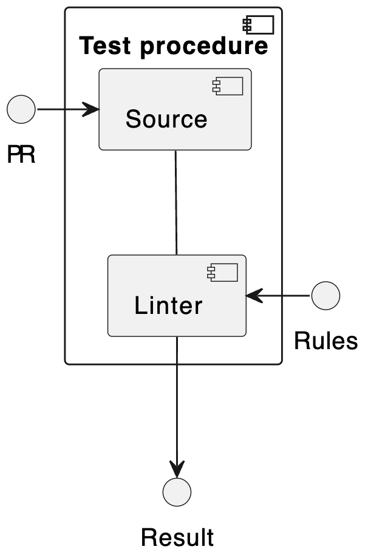
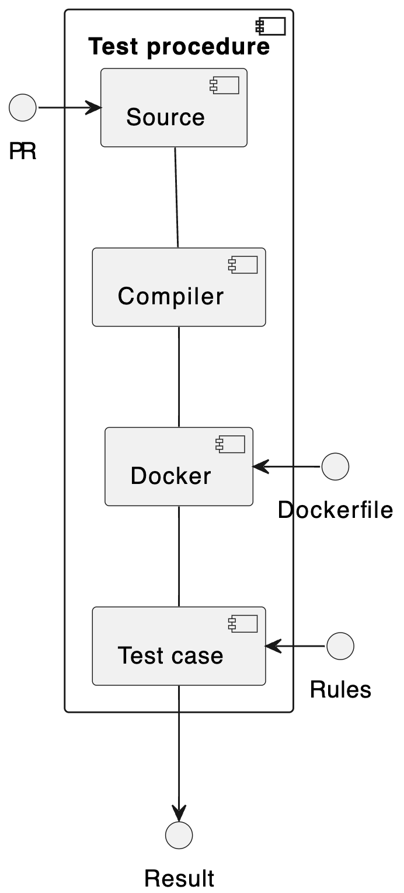
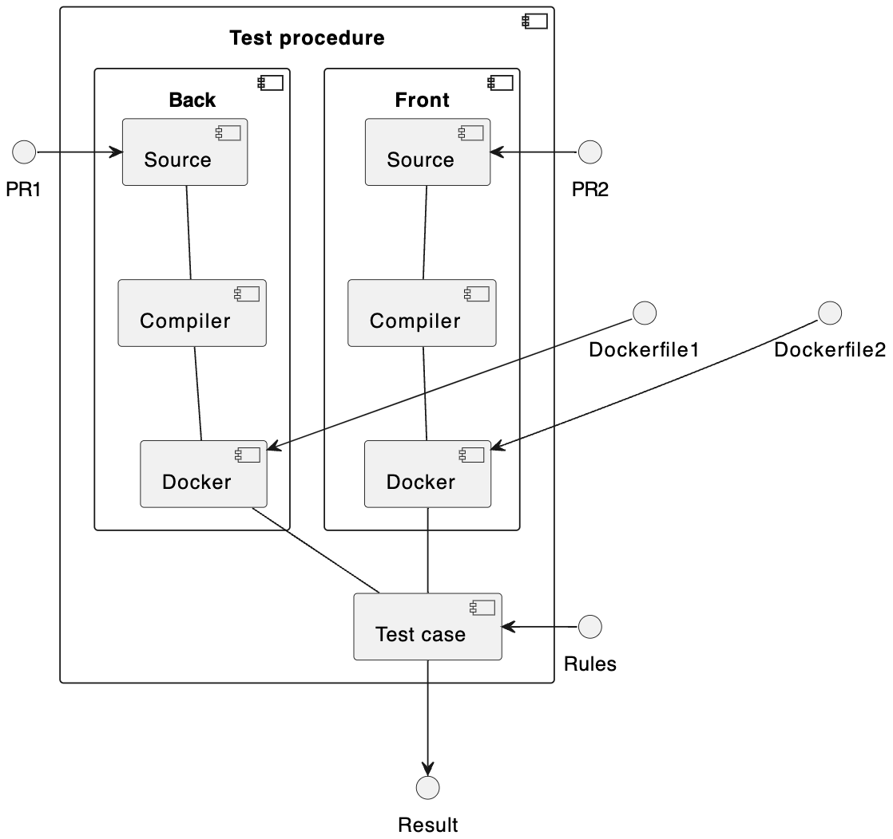
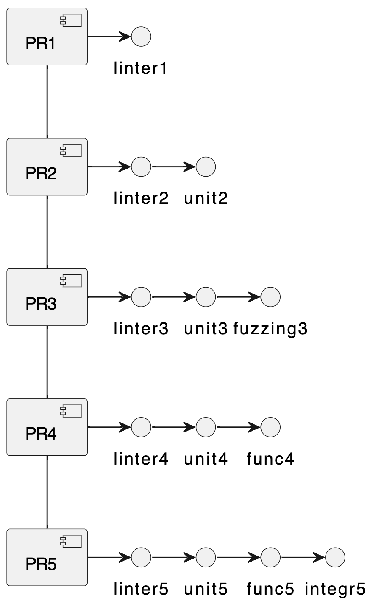
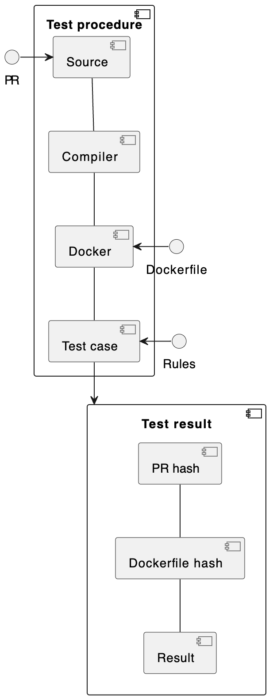
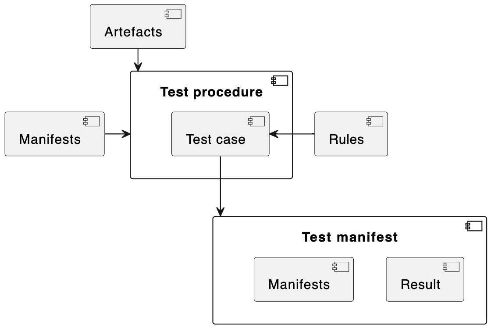

# Эффективность тестирования.

## Введение.

В отношение канонического определения, что такое тестирование программного обеспечения, нет единого мнения. Как утверждает [википедия](https://ru.wikipedia.org/wiki/Тестирование_программного_обеспечения), есть ряд непротиворечивых, но достаточно разнообразных определений. Все это следствие так называемого «парадокса тестирования». Не будем ломать традицию, и добавим еще одно.

Прежде всего, рассматривать тестирование только программного продукта не верно. Так как программа есть всегда результат компиляции некоторого кода, затем некоторой процедуры сборки, далее запуска в тестовом окружении и все перечисленные фазы воплощения программы могу сказаться на результатах теста. Так что же на самом деле тестируется? Следуя парадигме «все есть код», надо согласиться с тем, что тестируется код программного продукта, записанный в системе управления версиями, используя сборочные пайплайны, записанные в декларативной форме все в той же самой системе управления версиями, и даже запускается все процессы на тестовой инфраструктуре, которая тоже «as a code» записана в системе управления версиями. Все вообще изначально есть некоторое состояние системы управления версиями, которую далее для краткости время от времени будем называть просто git.

Второй вопрос, ответ на который уже почти совпадает с рядом официальных мнений, что понимается под успешным тестированием. И здесь, ожидаемо: успешным тестирование следует считать получение негативного ответа теста! Именно негативный ответ позволяет зафиксировать новое, неожиданное и, как правило, нежелательное поведение объекта тестирования. Смотрим выше, и расшифровываем: негативное тестирование указывает на точно такое же нежелательное состояние кода в git.

А теперь свяжем два тезиса вместе. _Объектом тестирования является код в системе управления версиями, и правильно проведенный тест должен своим негативным ответом указать на неверное изменение в системе управления версиями, которое и привело к такому результату._

Далее тестирование будет пониматься как эксперимент, проводимый над данными из системы управления версиями по принципу «черного ящика», то есть без относительно к сути самого эксперимента, и с разной степенью покрытия кода, и с разным уровнем тестирования, и прочее, и так далее. Не важно, что именно проверяется, главное, что на входе одним из параметров является код из git, а на выходе обязательно присутствует бинарный, или если удобно, дихотомический результат. И в данном случае существенно важными будут те кейсы, которые приводят к негативному ответу теста. 

Вот так все примерно и выглядит.

## Понятие эффективности тестирования.

Вот тут вообще, на первый взгляд и по ощущениям очень легко назвать массу критериев оценки эффективности. Прямо сразу, время проведения теста. Чуть подумав, мощность используемых ресурсов. И далее список вариантов можно продолжать. Но это все не тема данной статьи. Это все важные критерии для разработчиков тестов. А у нас тест это «черный ящик», и что внутри не важно! Снова возвращаемся к тому, как предлагается понимать как тест и в чем его цель.

Развитие любого программного проекта идет путем внесения изменений в систему контроля версий, а именно в git. И можно сказать, что с каждым обновлением git, а именно путем запроса изменений, или pull request, далее просто PR, меняется состояние всего репозитория git. И проведение тестов в том и заключается, чтобы предотвратить те изменения git, которые приводят к негативным результатам тестов. То есть тесты не обязательно проверяют непосредственно последние внесенные строки, даже более того, PR как он есть проверятся линтерами и всякими системами статического контроля, а наиболее «тяжелые» тесты проверяют уже как правило собранный продукт или даже всю продуктовую систему в целом.

Однако, нельзя упускать главную цель! Каким бы сложным не был тест, и в какой бы форме он не принимал исходные данные программы, все равно целью проверки остается состояние исходного кода, и в данном случае то самое изменение его, которое привело к негативному ответу теста.

Еще раз. Непосредственно в процедуре тестирования проблемный PR может даже никак не участвовать в исходной кодовой форме, но именно его слияние в репозитории приводит к срабатываю теста. И задачей постановки теста является создание условия для установления связи между результатом тестирования и тем самым PR, который на него повлиял.

Почему это важно? Потому, что срабатывание теста приводит к формированию ошибки, и далее устранением её занимается разработчик, путем внесения новых изменений в git таких, которые приведут к прохождению теста без ошибок. _И чем точнее тест, который проводится, как правило, автоматически, сможет в отчете об ошибке сослаться на возможные причины, те самые ошибочные PR, тем меньшая экспертиза потребуется для исследования ошибки и тем быстрее ошибка будет устранена._

Вот в этом и состоит _эффективность тестирования – получение максимально конкретной ссылки на неверное изменение кода в системе контроля версий._

Рассуждения, приведенные выше, применимы как к автоматическим, так и к ручным тестам. Но как сложная задача, вопрос эффективности тестирования возникает только в больших проектах, которые привлекают множество разработчиков, независимых тестеровщиков, и создают многокомпонентные продукты. Если тестируется небольшой проект, с одним выходным артефактом и узким кругом разработчиков, то дальше можно не читать, так как в небольших проектах ничего не стоит обеспечить покрытие тестами каждого PR в репозиторий проекта, и создать тем самым прямую зависимость результата тестирования и изменения кода git.

## Факторы приводящие к снижению эффективности тестирования.

Для начала рассмотрим самый простой вариант тестирования, а именно статическое тестирование исходного кода на соответствие некоторому своду правил.

В этом случае исследуется исходный код как есть, и взаимосвязь результата и приводящего к нему изменения кода более чем очевидна. Но все же стоит заметить, что в репозитории проекта скорее всего хранится не только исходный код программы PR, но и правила проверки синтаксиса Rules. То есть случай, когда к негативному ответу могут привести изменения в правилах так же, не стоит сбрасывать со счета.

Возьмем пример сложнее - проверка функционала. Для этого теста программу надо собрать, завернуть в образ контейнера и запустить на исполнение для тестовых проверок согласно заданным правилам. И здесь кроме исходного PR и уже упомянутых Rules добавляется еще и Dockerfile, который в общем то сам по себе и код и маленький проект, и в него тоже время от времени вносятся изменения через свои PR. Таким образом, уже получаем две зависимости от развития кода проекта и выбор какое точно изменение привело к ошибке в тесте уже требует как минимум изучения протоколов тестовой процедуры.

Тут уже более чем очевидно каким путем пойдет далее процесс усложнения тестовых процедур. Но для порядка просто представим еще один шаг. Вот как будет выглядеть интеграционный тест для двух взаимодействующих серфисов.

Здесь представлен тест самого незамысловатого сервиса front-back и какая-то примитивная проверка совместной работы. Две компоненты сразу дали удвоение входных параметров, представленных как изменения кода репозитория проекта.

Как правило реальные проекты разбиваются на очень большое число независимо разрабатываемых функциональных компонентов и их совместное тестирование создает весьма неочевидные связи между большим числом изменений кода и фактически единственно возможной резолюцией теста прошел – не прошел.

Это и есть первая причина снижения эффективности тестирования. _На высокоуровневых тестах создается очень много зависимостей от изменений исходного кода._ Именно это усложняет анализ причин, приведших к срабатыванию теста.

Вторая проблема также является «болезнью» больших проектов. Если статические тесты сопровождают каждый PR, то по мере усложнения тестирования из-за того, что для проведения все более и более полных тестов требуются серьезные ресурсы, то такие тесты проводят не на каждый PR, а с иной периодичностью. И если тесты еще не автоматизированы, то вопрос о периодичности вообще не стоит, так как эти тесты выполняются в соответствие с конкретными заданиями тестировщиков. И что же мы тогда получаем.

Представим себе, что сложилась такая ситуация, как выше на диаграмме. Каждый PR сопровождается статическим анализом. Если PR происходит в области кода, то дополнительно выполняются unit-тесты. Как только складываются условия для выполнения fuzzing-тестирования, он запускается. По мере возможностей выполняется функциональной тестирование. И вот, в некоторый момент запускается интеграционное тестирование. И неожиданно этот тест приводит к срабатыванию. Как определить, какой именно PR привел к ошибке теста?

Таким образом, _неполнота покрытия тестами всех изменений в репозитории затрудняет установление того изменения, что привел к срабатыванию теста._

Оба указанных фактора прямо следуют из природы больших проектов. И бороться с их возникновением не представляется возможным в силу разных причин. А вот следующий фактор формируется просто из-за особенностей примитивного дизайна сборочных систем.

Выше уже было показано, как затрудняется связь между исходным PR и результатом теста и к чему это приводит. Однако, в большинстве сборочных конвейеров компоненты продуктовых систем сопровождаются только их версиями. Причем стоит заметить, что слепое следование semantic versioning еще более затрудняет связывание артефакта, помеченного тегом версии, и конкретного PR, который изменил проверяемый код. Неожиданно, как раз те команды, которые подмешивают в тег версии свои частные метки, могут хоть как-то указать на код без обязательного изучения истории сборки!

И вот последний фактор, сформулированный в исчерпывающей форме: _артефакты, формируемые в сборочных конвейерах, как правило, не сопровождаются сборочными манифестами, а лишь только тегами версионирования, что затрудняет изучение причины срабатывания теста, как вливание ошибочного кода в репозиторий проекта._

А вот теперь, посмотрим, как с эти всем можно бороться.

## Обеспечение полноты данных для исследования ошибки теста.

Как выше было сказано, главные сложности возникают на высокоуровневых тестах, где сложные системы собираются из ранее созданных артефактов и проверяются совместно со всеми компонентами, такими как программный код, всякого рода метаданными, включая базы данных и миграции.

И проблема начинается с того, что артефакты передаются с одного этапа сборки на другой без информации об условиях сборки. Хотя, как это обычно бывает, конвейеры сборки сопровождают свою работу так называемыми манифестом сборки или build manifest – специальным репортом о переменных времени сборки. Да, так и происходит, артефакт передается в дроп-область, и далее используется как часть продукта, а вся информация об условиях сборки остаётся в протоколах сборочных конвейеров и извлекается только в процессе исследования ошибки.

Технически не сложно найти все историю сборки. Любой создаваемый артефакт обычно тегируется нарастающей версией. По значению версии можно найти в истории конвейера нужный запуск. Извлечь протоколы. И там прочитать все необходимое о состоянии репозитория кода перед сборкой. Так можно. Но очень сложно и долго.

Правильным будет сопровождать каждый собранный артефакт сборочным манифестом. Тогда в процедуре теста не сложно собрать всю информацию о составных частях объекта проверки и сопроводить ею результат теста.

Проиллюстрируем вышесказанное для тестовой процедуры одного сервиса, если компонентов будет больше, то результирующий репорт увеличится.

Итак, первое что необходимо сделать, включить манифесты сборки в состав артефактов. Затем обеспечить сопровождение результатов тестирования данными из всех сборочных манифестов компонентов, участвующих в тестировании. И это даст возможность разработчику сразу получить всю информацию о коде и его последних изменениях.

Здесь можно сказать, что тестовый конвейер или тестовое задание сборочного конвейера создает специальный артефакт, содержащий как результат теста, так и все манифесты кода компонентов, участвующих в тестировании. И с таким артефактом надо поступать точно также как и со всеми сборочными артефактами, а именно сохранять в специально выделенной области, например, на общем сетевом томе.

Вот тут, казалось бы, все, но нет. Необходимо так изменить дизайн сборочных и тестовых конвейеров, чтобы избежать ложных срабатываний, как позитивных, так и негативных, в процессе формирования тестовых артефактов. Почему это важно. Дело в том, что сам конвейер тоже своего рода тест, и тоже, к слову заметить, храниться в репозитории проекта, и в точности как любой тест может формировать ошибки исполнения. Вот тут внимание! Тест не должен завершаться ошибкой исполнения конвейера, а ошибка исполнения конвейера не должна подмешиваться в историю тестирования. Тест в том понимании, как описано выше, точно такое же формирующее артефакт исполнения действие, как и любой сборочный процесс.

И чтобы закончить этот раздел, стоит заметить, что понятие манифест сборки фактически играет роль внутреннего Software Bill Of Materials. И точно также может, и даже должен, содержать информацию не только о коде проекта, но и о коде или версиях всех внешних компонентов. В такой полноте описания условий проведения тестов, особенно учитывая то, что манифесты тестирования будут сохраняться и представлять данные для ретроспективного анализа, можно быть уверенным, что исследование причин срабатывания теста будет иметь больше шансов на успех в кратчайшие сроки.

## Автоматическая обработка результатов тестирования.

Провести преобразования сборочной и тестовой среды в соответствие с предложенными выше идеями не просто и потребует некоторых усилий. Однако, после того как артефакты тестирования начнут накапливаться можно будет попытаться их обрабатывать в автоматическом режиме, еще более повышая эффективность тестирования за счет сужения выбора кода для анализа разработчиком, привлеченным для решения ошибки.

Рассмотрим обобщенную диаграмму тестирования.

Изображенное не требует особых пояснений. Представим, что такая процедура выполняется как серия, состоящая из множества запусков выбранного теста. Можно заметить, что так как Test case не меняется, то не меняется и набор правил Rules. Это нормально в практике. Поскольку Test case служит проверке соответствия программного обеспечения некоторому требованию, то можно утверждать, что требование и сам Test case и его Rules, осуществляющие данную проверку, также константны во все время применения выбранной тестовой процедуры. Любое изменение требований приведет к изменению Test case или его Rules, создав тем самым новую тестовую процедуру.

Рассуждая далее, артефакты полностью описываются набором их сборочных манифестов. Тогда можно исключить их анализа сами артефакты и рассматривать только их сборочные манифесты. А поскольку, как было предложено в разделе выше, все сборочные манифесты входят в отчет теста «as is», то можно полностью ограничиться анализом только тестовых манифестов. Так как они содержат все необходимые данные о входных артефактах и о результате самого теста.

И теперь вся серия тестов может быть представлена набором тестовых манифестов. Внутри содержится некий одномерный массив сборочных манифестов и результат теста. А вот теперь будем считать, что набор сборочных манифестов, это координатный вектор из N элементов, где N соответствует числу входных артефактов, и этот вектор указывает на некую точку в N-мерном пространстве.

Представим, что тесты — это артиллерийские выстрелы в N-мерном пространстве. Причем стрельба ведется невесом через N-мерный холм по невидимой стрелку/разработчику мишени. Каждый выстрел наводится путем задания N координат. Поскольку данная модель должна учитывать модель коллективной разработки, то в процедуре прицеливания участвуют N стрелков/разработчиков, и каждый подходит к орудию и вводит новую координату или повторяет ранее установленную. Выстрел производится только последним стрелком. И вот, после ряда неудачных выстрелов «успешных тестов» наконец случается попадание – срабатывание теста! Как теперь понять, действия какого стрелка привели к попаданию, к срабатыванию теста?

Самое простое это попытаться построить ретроспекцию изменений прицела, исключая из анализа те координаты, что не менялись. Это очевидное. Далее надо учесть специфику коллективной разработки, которая ведется в парадигме так называемых ветвей (branch). Говоря иначе, в ретроспекцию неудачных попыток надо включать только те, что использовали код из той же самой ветви, что и в попадании! И в оставшемся множестве координат надо выбрать самую ближнюю к точке попадания. Вот тут кроме уникально хеша, указывающего на конкретный PR, следует добавить еще одну метрику, позволяющую определить удаленность от выбранной координаты. В этом нет ничего невозможного, так как все PR, и все commit упорядочены в пределах своих ветвей. И можно воспользоваться меткой времени, чтобы из набора возможных PR выбрать самый поздний, и значит самый близкий к PR попадания. Конфликтный код будет содержаться в выявленном промежутке изменений от последнего успешного PR, до PR попадания. Если такая координата одна, то задача в автоматическом режиме сводится к повторению теста со всеми PR в найденном промежутке. Очевидно, это не может быть много. А вот если обнаружено множественное изменение, и в анализ попала еще одна «координата», и соответственно еще один артефакт, то автоматический резолвинг такой ошибке становится комбинаторно сложным.

И вот здесь можно воспользоваться тем фактом, что ошибки в коде, приводящие к срабатыванию теста, возникают не произвольно, а в соответствии с дизайном всего проекта и теста в том числе. Иначе говоря, можно заранее задать диапазон поиска изменений сборочного манифеста. Ну, так вот смело, за счет экспертизы тестировщика. А можно набрать статистику исправлений и на этом основании ранжировать результаты так, чтобы свести автоматические проверки к тоже самому простому ряду повторений теста для одного компонента кода в заданном периоде изменений git. Для этого достаточно отмечать исправления и сохранять их в той же серии накопления тестовых манифестов. И кстати, эту процедуру также можно автоматизировать.

Таким образом, после срабатывания теста можно провести дополнительную обработку результатов тестов, накопленных ранее, и существенно сузить выбор для ручного анализа, или даже автоматически, путем проведения тестов с установленным набором изменений проектного кода, выйти на конкретный ошибочный код.

## Заключение.

Подведем итоги.  Для увеличения эффективности тестирования, а именно с целью ускорения установления взаимосвязи результатов тестовых процедур и изменений кода проекта, очень полезно выполнить ряд следующих рекомендаций:

1.	Сопроводить все создаваемые продуктовые и даже промежуточные артефакты сборочными манифестами, включающими в обязательном порядке хеш репозитория, дату слияния и ветку кода.

2.	Сопроводит исполнение тестов формированием тестового манифеста, включающего все манифесты задействованных в тестировании внутренних артефактов и внешний компонентов в виде SBOM.

3.	Исключить возможность ложного срабатывания тестовых заданий за счет ошибок исполнения конвейера и выделить сохранение артефакта тестирования в отдельную процедуру.

4.	Обеспечить историю хранения артефактов тестирования таким же образом, как и всех других порождаемых в процессе сборки артефактов, с целью дальнейшей обработки.

Перечисленные меры не создадут моментально эффект «серебряной пули», но позволят увеличить информированность разработчиков, устраняющих ошибки, обнаруженные в процессе тестирования, могут быть использованы в процедурах автоматического формирования заданий для устранения ошибок, и, как было выше предложено, могут также обеспечивать предварительное исследование ошибочной ситуации.
